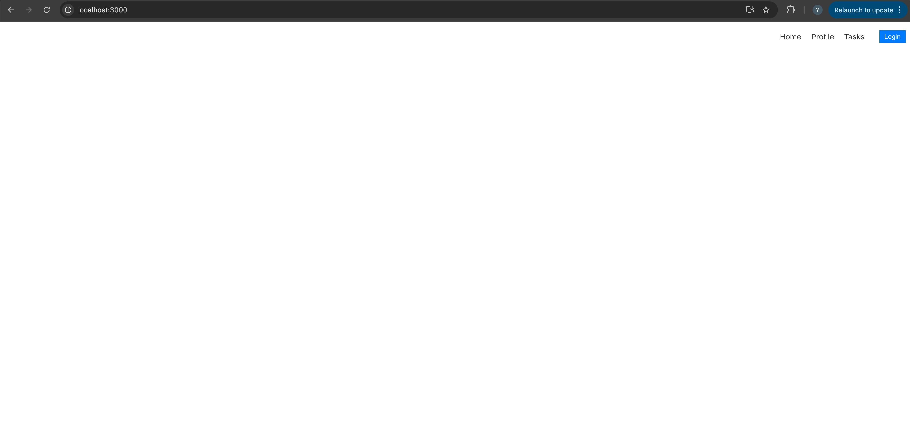
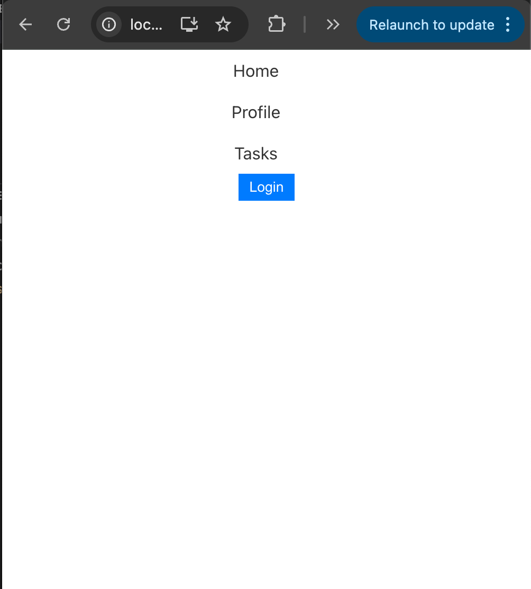
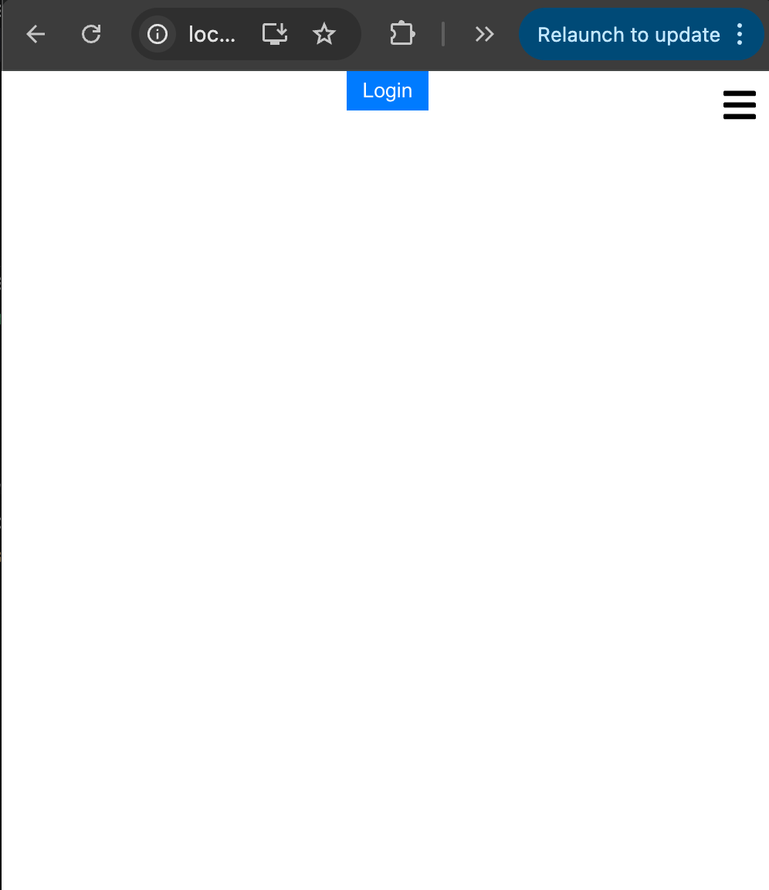
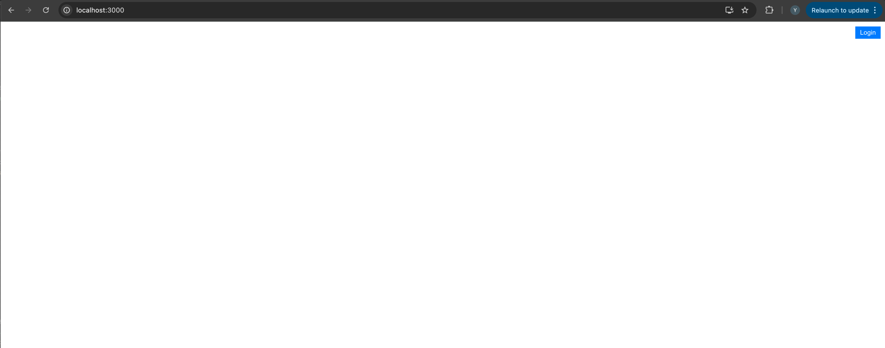
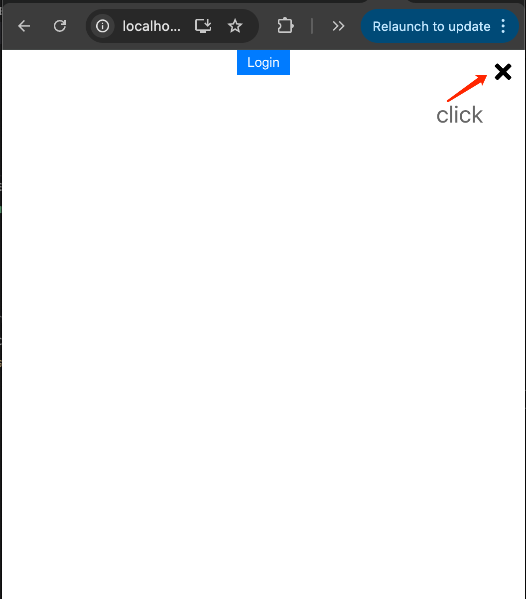
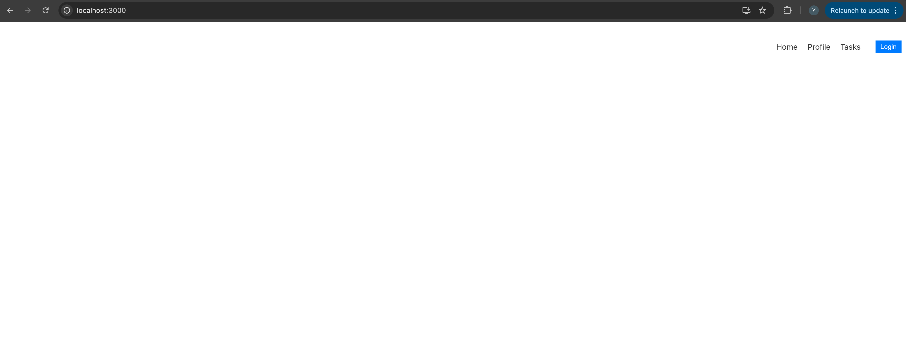
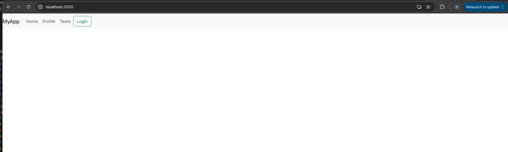
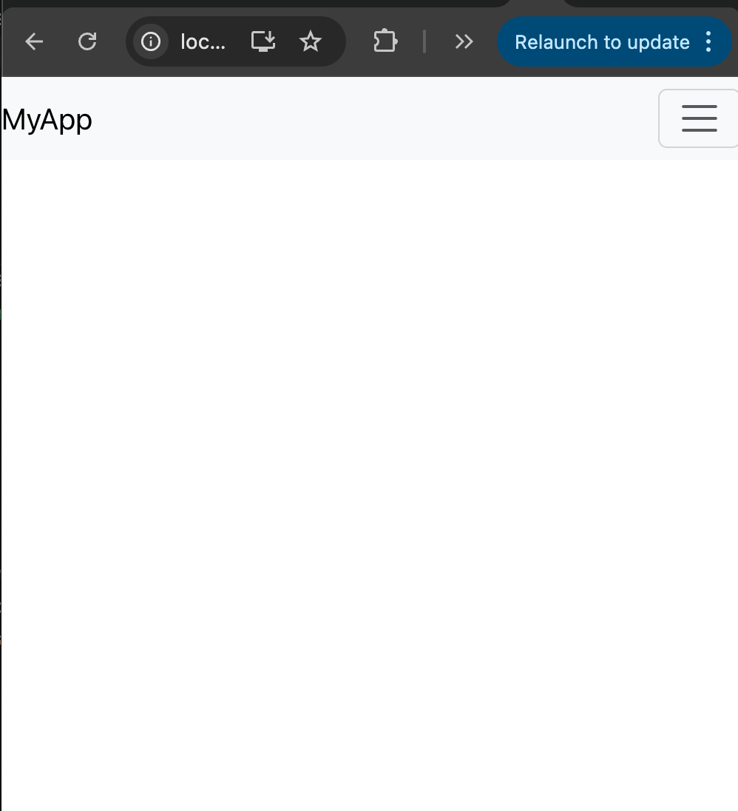
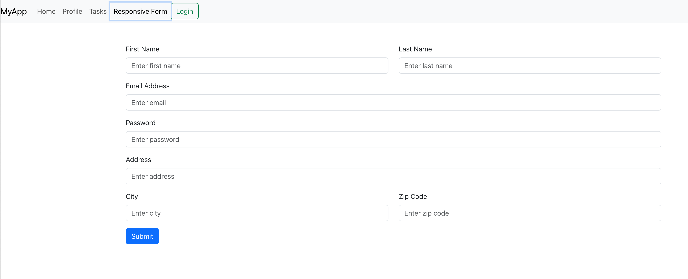

# Activity 0 - Setup

### Instructions

0. Start by creating a new folder named Lab 11 to organize all the files for this lab.
1. Inside the lab11 folder, initialize a new React project: npx create-react-app .
2. Navigate to the folder and open it in a code editor.
3. Install router dom using `npm install react-router-dom`
4. DO the ACTIVITIES

# Activity 1 – Navigation component

### Instructions

1. Create the following JavaScript files in the src directory if not exist:

- NavigationComponent.js
- App.js
- Home.js
- Profile.js
- Tasks.js
- NavigationComponent.css

2. Use the following code to implement each of the files:

```javascript
// NavigationComponent.js
import React from "react";
import { Link } from "react-router-dom";
import "./NavigationComponent.css";

const NavigationComponent = ({
  isAuthenticated,
  handleLogin,
  handleLogout,
}) => {
  return (
    <nav className="navigation">
      <div className="nav-links">
        <Link to="/home">Home</Link>
        <Link to="/profile">Profile</Link>
        <Link to="/tasks">Tasks</Link>
      </div>
      <div className="auth-buttons">
        {isAuthenticated ? (
          <button onClick={handleLogout}>Logout</button>
        ) : (
          <button onClick={handleLogin}>Login</button>
        )}
      </div>
    </nav>
  );
};

export default NavigationComponent;
```

```javascript
// App.js
import React, { useState } from "react";
import { BrowserRouter as Router, Route, Routes } from "react-router-dom";
import NavigationComponent from "./NavigationComponent";
import Home from "./Home";
import Profile from "./Profile";
import Tasks from "./Tasks";

function App() {
  const [isAuthenticated, setIsAuthenticated] = useState(false);

  const handleLogin = () => setIsAuthenticated(true);
  const handleLogout = () => setIsAuthenticated(false);

  return (
    <Router>
      <NavigationComponent
        isAuthenticated={isAuthenticated}
        handleLogin={handleLogin}
        handleLogout={handleLogout}
      />
      <Routes>
        <Route path="/home" element={<Home />} />
        <Route path="/profile" element={<Profile />} />
        <Route path="/tasks" element={<Tasks />} />
      </Routes>
    </Router>
  );
}

export default App;
```

```javascript
// Home.js
import React from "react";

const Home = () => {
  return (
    <div>
      <h1>Home Page</h1>
      <p>Welcome to the Home Page!</p>
    </div>
  );
};

export default Home;
```

```javascript
// Profile.js
import React from "react";

const Profile = () => {
  return (
    <div>
      <h1>Profile Page</h1>
      <p>Welcome to your Profile!</p>
    </div>
  );
};

export default Profile;
```

```javascript
// Tasks.js
import React from "react";

const Tasks = () => {
  return (
    <div>
      <h1>Tasks Page</h1>
      <p>Here are your tasks!</p>
    </div>
  );
};

export default Tasks;
```

```css
/* NavigationComponent.css */
.navigation {
  display: flex;
  flex-direction: column;
  align-items: center;
}

@media (min-width: 576px) {
  .navigation {
    flex-direction: row;
    justify-content: flex-end;
    padding: 10px;
    align-items: center;
  }
}

.nav-links {
  margin-right: 20px;
  display: flex;
  flex-direction: column;
  align-items: center;
}

@media (min-width: 576px) {
  .nav-links {
    flex-direction: row;
  }
}

.nav-links a {
  margin: 10px;
  text-decoration: none;
  color: #333;
}

.auth-buttons button {
  background-color: #007bff;
  color: white;
  border: none;
  padding: 5px 10px;
  cursor: pointer;
}

.auth-buttons button:hover {
  background-color: #0056b3;
}
```

3. To run the project, use the command: npm start
4. Navigate to http://localhost:3000 to view your application in the browser.
5. Make sure the navigation adapt to different screen sizes: align the items in a row to the right on larger screens and stack them in a column on smaller screens.

### Output




# Activity 2 – Menu icon

### Instructions

1. Add a Menu Icon to the Navigation Component
   Open NavigationComponent.js.
   Install react icons (`npm install react-icons`)
   Import FaBars and FaTimes from "react-icons/fa" to use as the hamburger and close icons.
   Add a <div> with a class of "menu-icon" before the navigation links (<div className="nav-links">).
   Use this <div> to show either the <FaBars /> or <FaTimes /> icon depending on whether the menu is open or closed.

2. Use State to Track the Menu's Open/Closed Status
   Import useState from React to create a state variable for managing the menu's open or closed status.
   Create a state variable isMenuOpen using useState and initialize it as false.

3. Add a Click Event to Toggle the Menu
   Create a function called toggleMenu to toggle the value of isMenuOpen between true and false.
   Attach the toggleMenu function to the <div> with the class "menu-icon" so that clicking on the icon will open or close the menu.

4. Conditionally Render Navigation Links
   Wrap the navigation links (<div className="nav-links">) with conditional rendering based on the isMenuOpen state.
   Modify the rendering logic so that the links are visible only when isMenuOpen is true, regardless of screen size.
   This means users can use the menu icon to open and close the menu on both small and large screens.

5. Verify the Functionality
   On small screens, the menu should be hidden initially and should open when the hamburger icon (<FaBars />) is clicked.
   On larger screens, the menu is also hidden initially, but it can be opened or closed by clicking on the icon (<FaTimes /> when open).
   Make sure the menu icon is always visible to allow users to control the visibility of the navigation links on all screen sizes.

Update the code as follows:

```javascript
// NavigationComponent.js
import React, { useState } from "react";
import { Link } from "react-router-dom";
import { FaBars, FaTimes } from "react-icons/fa";
import "./NavigationComponent.css";

const NavigationComponent = ({
  isAuthenticated,
  handleLogin,
  handleLogout,
}) => {
  const [isMenuOpen, setIsMenuOpen] = useState(false);

  // Function to toggle the menu
  const toggleMenu = () => {
    setIsMenuOpen(!isMenuOpen);
  };

  return (
    <nav className="navigation">
      {/* Menu icon for both smaller and larger screens */}
      <div className="menu-icon" onClick={toggleMenu}>
        {isMenuOpen ? <FaTimes /> : <FaBars />}
      </div>

      {/* Navigation links - display based on the isMenuOpen state */}
      {isMenuOpen && (
        <div className="nav-links">
          <Link to="/home">Home</Link>
          <Link to="/profile">Profile</Link>
          <Link to="/tasks">Tasks</Link>
        </div>
      )}

      {/* Authentication buttons */}
      <div className="auth-buttons">
        {isAuthenticated ? (
          <button onClick={handleLogout}>Logout</button>
        ) : (
          <button onClick={handleLogin}>Login</button>
        )}
      </div>
    </nav>
  );
};

export default NavigationComponent;
```

6. Update CSS for Responsive Styling
   Open NavigationComponent.css and apply the following changes to create a responsive menu.

```css
/* NavigationComponent.css */
.navigation {
  display: flex;
  flex-direction: column;
  align-items: center;
  position: relative;
}

@media (min-width: 576px) {
  .navigation {
    flex-direction: row;
    justify-content: flex-end;
    padding: 10px;
    align-items: center;
  }
}

.menu-icon {
  display: block;
  font-size: 24px;
  cursor: pointer;
  position: absolute;
  top: 10px;
  right: 10px;
}

@media (min-width: 576px) {
  .menu-icon {
    display: none;
  }
}

.nav-links {
  margin-right: 20px;
  display: none;
  flex-direction: column;
  align-items: center;
  background-color: #333;
  position: absolute;
  top: 50px;
  left: 0;
  right: 0;
  padding: 20px 0;
  z-index: 10;
}

.nav-links a {
  margin: 10px;
  text-decoration: none;
  color: #fff;
}

@media (min-width: 576px) {
  .nav-links {
    display: flex;
    position: static;
    flex-direction: row;
    background-color: transparent;
  }

  .nav-links a {
    color: #333;
  }
}

.auth-buttons button {
  background-color: #007bff;
  color: white;
  border: none;
  padding: 5px 10px;
  cursor: pointer;
}

.auth-buttons button:hover {
  background-color: #0056b3;
}
```

### Output






# Activity 3 – Window Resize event

### Instructions

1. Add State to Track Screen Width
   Import useState and useEffect from React.
   Create a new state variable called screenWidth to track the current width of the window.
   Initialize it with window.innerWidth so that it starts with the current width.

2. Use useEffect to Handle Window Resize Events
   Use the useEffect hook to add an event listener for the window resize event.
   Define a handleResize function that updates the screenWidth whenever the window is resized.

3. Update the Conditional Rendering Logic for Navigation Links
   Update the rendering of the navigation links (nav-links) so that they are always visible when screenWidth > 576 pixels.
   The navigation links should only depend on the following conditions:
   The menu is open (isMenuOpen === true).
   The screen width is greater than 576 pixels (screenWidth > 576).

4. Update the code as follows:

```javascript
// NavigationComponent.js
import React, { useState, useEffect } from "react";
import { Link } from "react-router-dom";
import { FaBars, FaTimes } from "react-icons/fa";
import "./NavigationComponent.css";

const NavigationComponent = ({
  isAuthenticated,
  handleLogin,
  handleLogout,
}) => {
  const [isMenuOpen, setIsMenuOpen] = useState(false);
  const [screenWidth, setScreenWidth] = useState(window.innerWidth);

  // Function to toggle the menu
  const toggleMenu = () => {
    setIsMenuOpen(!isMenuOpen);
  };

  // UseEffect to handle window resize events
  useEffect(() => {
    const handleResize = () => {
      setScreenWidth(window.innerWidth);
    };

    // Add window resize event listener
    window.addEventListener("resize", handleResize);

    // Cleanup function to remove event listener when component unmounts
    return () => {
      window.removeEventListener("resize", handleResize);
    };
  }, []);

  return (
    <nav className="navigation">
      {/* Menu icon for both smaller and larger screens */}
      <div className="menu-icon" onClick={toggleMenu}>
        {isMenuOpen ? <FaTimes /> : <FaBars />}
      </div>

      {/* Navigation links - display if menu is open or if screen width is greater than 576px */}
      {(isMenuOpen || screenWidth > 576) && (
        <div className="nav-links">
          <Link to="/home">Home</Link>
          <Link to="/profile">Profile</Link>
          <Link to="/tasks">Tasks</Link>
        </div>
      )}

      {/* Authentication buttons */}
      <div className="auth-buttons">
        {isAuthenticated ? (
          <button onClick={handleLogout}>Logout</button>
        ) : (
          <button onClick={handleLogin}>Login</button>
        )}
      </div>
    </nav>
  );
};

export default NavigationComponent;
```

# Activity 4 – Responsive Navigation using Bootstrap

### Instructions

1. Install the Required Dependencies:
   Ensure you have react-bootstrap and react-router-bootstrap installed:
   `npm install react-bootstrap react-router-bootstrap`
   `npm install react-bootstrap bootstrap`

2. Update Imports:
   Import Navbar, Nav, and Button from react-bootstrap.
   Import LinkContainer from react-router-bootstrap to wrap React Bootstrap elements and make them behave like React Router <Link>.

3. Replace Existing Navigation with React Bootstrap Components:
   Replace the custom menu icon logic with the built-in Navbar.Toggle and Navbar.Collapse to handle responsive behavior automatically.
   Use LinkContainer to wrap each Nav.Link for navigation.

4. Update the code as follows:

```javascript
// NavigationComponent.js
import React from "react";
import { Navbar, Nav, Button } from "react-bootstrap";
import { LinkContainer } from "react-router-bootstrap";
import "bootstrap/dist/css/bootstrap.min.css";

const NavigationComponent = ({
  isAuthenticated,
  handleLogin,
  handleLogout,
}) => {
  return (
    <Navbar bg="light" expand="md" className="navigation">
      <Navbar.Brand href="/">MyApp</Navbar.Brand>
      <Navbar.Toggle aria-controls="basic-navbar-nav" />
      <Navbar.Collapse id="basic-navbar-nav">
        <Nav className="mr-auto">
          {/* Use LinkContainer to wrap each Nav.Link */}
          <LinkContainer to="/home">
            <Nav.Link>Home</Nav.Link>
          </LinkContainer>
          <LinkContainer to="/profile">
            <Nav.Link>Profile</Nav.Link>
          </LinkContainer>
          <LinkContainer to="/tasks">
            <Nav.Link>Tasks</Nav.Link>
          </LinkContainer>
        </Nav>
        <div className="auth-buttons">
          {isAuthenticated ? (
            <Button variant="outline-primary" onClick={handleLogout}>
              Logout
            </Button>
          ) : (
            <Button variant="outline-success" onClick={handleLogin}>
              Login
            </Button>
          )}
        </div>
      </Navbar.Collapse>
    </Navbar>
  );
};

export default NavigationComponent;
```

### Output





# Activity 5 – Responsive Form

### Instructions

1. Create the Responsive Form Component (ResponsiveForm.js)
Create a new file called ResponsiveForm.js in your project folder.
The form is wrapped in <Form>, and Bootstrap's grid system (<Row> and <Col>) is used to make it responsive.
Form Groups (Form.Group) are used for each field to provide a label and input control.
The as={Col} md="6" prop allows the input to take up half the row on medium or larger screens, while on smaller screens it will occupy the entire row.
A Submit Button is added at the end using the Bootstrap Button component.

2. Use the following code to define a responsive form using React Bootstrap components:

```javascript
// ResponsiveForm.js
import React from "react";
import { Form, Button, Row, Col } from "react-bootstrap";

const ResponsiveForm = () => {
  return (
    <Form className="p-4">
      <Row className="mb-3">
        {/* First Name */}
        <Form.Group as={Col} md="6" controlId="formFirstName">
          <Form.Label>First Name</Form.Label>
          <Form.Control type="text" placeholder="Enter first name" required />
        </Form.Group>

        {/* Last Name */}
        <Form.Group as={Col} md="6" controlId="formLastName">
          <Form.Label>Last Name</Form.Label>
          <Form.Control type="text" placeholder="Enter last name" required />
        </Form.Group>
      </Row>

      <Row className="mb-3">
        {/* Email */}
        <Form.Group as={Col} md="12" controlId="formEmail">
          <Form.Label>Email Address</Form.Label>
          <Form.Control type="email" placeholder="Enter email" required />
        </Form.Group>
      </Row>

      <Row className="mb-3">
        {/* Password */}
        <Form.Group as={Col} md="12" controlId="formPassword">
          <Form.Label>Password</Form.Label>
          <Form.Control type="password" placeholder="Enter password" required />
        </Form.Group>
      </Row>

      <Row className="mb-3">
        {/* Address */}
        <Form.Group as={Col} md="12" controlId="formAddress">
          <Form.Label>Address</Form.Label>
          <Form.Control type="text" placeholder="Enter address" />
        </Form.Group>
      </Row>

      <Row className="mb-3">
        {/* City */}
        <Form.Group as={Col} md="6" controlId="formCity">
          <Form.Label>City</Form.Label>
          <Form.Control type="text" placeholder="Enter city" />
        </Form.Group>

        {/* Zip Code */}
        <Form.Group as={Col} md="6" controlId="formZip">
          <Form.Label>Zip Code</Form.Label>
          <Form.Control type="text" placeholder="Enter zip code" />
        </Form.Group>
      </Row>

      {/* Submit Button */}
      <Button variant="primary" type="submit">
        Submit
      </Button>
    </Form>
  );
};

export default ResponsiveForm;
```
3. Import and Use the Responsive Form in App.js
Now that you have the ResponsiveForm.js component, import it into App.js and render it within the main app structure.

```javascript
// App.js
import React, { useState } from 'react';
import { BrowserRouter as Router, Route, Routes } from 'react-router-dom';
import NavigationComponent from './NavigationComponent';
import Home from './Home';
import Profile from './Profile';
import Tasks from './Tasks';
import ResponsiveForm from './ResponsiveForm';
import 'bootstrap/dist/css/bootstrap.min.css';  // Import Bootstrap CSS

function App() {
  const [isAuthenticated, setIsAuthenticated] = useState(false);

  const handleLogin = () => setIsAuthenticated(true);
  const handleLogout = () => setIsAuthenticated(false);

  return (
    <Router>
      {/* Navigation Bar */}
      <NavigationComponent 
        isAuthenticated={isAuthenticated} 
        handleLogin={handleLogin} 
        handleLogout={handleLogout}
      />
      <div className="container mt-4">
        <Routes>
          <Route path="/home" element={<Home />} />
          <Route path="/profile" element={<Profile />} />
          <Route path="/tasks" element={<Tasks />} />
          <Route path="/responsiveForm" element={<ResponsiveForm />} />
        </Routes>
      </div>
    </Router>
  );
}

export default App;

```

4. Update NavigationComponent.js
```javascript
// NavigationComponent.js
import React from "react";
import { Navbar, Nav, Button } from "react-bootstrap";
import { LinkContainer } from "react-router-bootstrap";
import 'bootstrap/dist/css/bootstrap.min.css';

const NavigationComponent = ({ isAuthenticated, handleLogin, handleLogout }) => {
  return (
    <Navbar bg="light" expand="md" className="navigation">
      <Navbar.Brand href="/">MyApp</Navbar.Brand>
      <Navbar.Toggle aria-controls="basic-navbar-nav" />
      <Navbar.Collapse id="basic-navbar-nav">
        <Nav className="mr-auto">
          {/* Navigation Links using LinkContainer for React Router */}
          <LinkContainer to="/home">
            <Nav.Link>Home</Nav.Link>
          </LinkContainer>
          <LinkContainer to="/profile">
            <Nav.Link>Profile</Nav.Link>
          </LinkContainer>
          <LinkContainer to="/tasks">
            <Nav.Link>Tasks</Nav.Link>
          </LinkContainer>
          <LinkContainer to="/responsiveForm">
            <Nav.Link>Responsive Form</Nav.Link>
          </LinkContainer>
        </Nav>
        <div className="auth-buttons">
          {isAuthenticated ? (
            <Button variant="outline-primary" onClick={handleLogout}>
              Logout
            </Button>
          ) : (
            <Button variant="outline-success" onClick={handleLogin}>
              Login
            </Button>
          )}
        </div>
      </Navbar.Collapse>
    </Navbar>
  );
};

export default NavigationComponent;
```

### Output


